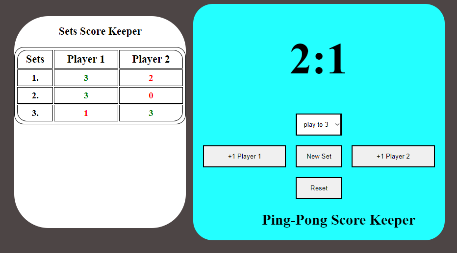

# Ping Pong Counter



## Table of Contents
- [Description](#description)
- [Demo](#demo)
- [Features](#features)
- [Installation](#installation)
- [Usage](#usage)
- [License](#license)
- [Contact](#contact)

## Description
Ping Pong Counter is a simple web application designed to help you keep track of scores in ping pong and many other games. This project was created as a part of my journey into web development.

## Demo
Check out the live version of the application here: [Ping Pong Counter on GitHub Pages](https://dcdavidcerny.github.io/PingPong/)

## Features
- Easy to use interface
- Real-time score updates
- Customizable for different games (different score limit before new set)

## Installation
To get a local copy up and running follow these simple steps:

1. **Clone the repository**
    ```sh
    git clone https://github.com/dcDavidCerny/PingPong.git
    ```
2. **Navigate to the project directory**
    ```sh
    cd PingPong
    ```
3. **Open `index.html` in your browser**
    Simply double-click the `index.html` file or open it with your preferred browser.

## Usage
1. Open the application in your web browser.
2. Set the score limit you desire
3. Use the buttons to increment the score for each player.
4. Click on new set to begin a new set
5. Reset the score using the reset button.

## License
There is no license yet. It will be determined in the future.

## Contact
Your Name - [dcdavidcerny@gmail.com](mailto:dcdavidcerny@gmail.com)

Project Link: [https://github.com/dcDavidCerny/PingPong](https://github.com/dcDavidCerny/PingPong)
